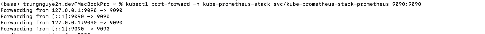

# Week9

### Họ và tên: Nguyễn Trung Nguyên

### Mã số sinh viên: 22024553

### Instal kube-prometheus-stack

### Run a Prometheus query

#### Table

#### Graph

### Use Grafana dashboards

#### Explore the Grafana pre-built dashboards

Monitoring cluster utilization with “Kubernetes / Compute Resources / Cluster”

Viewing a node’s resource consumption with “Node Exporter / Nodes”

Viewing the resource consumption of individual pods with “Kubernetes / Compute Resources / Pod”

### Configure alerts with Alertmanager

Next run the following command to simulate triggering a basic alert from a Kubernetes service in a specific namespace:

$ curl -H 'Content-Type: application/json' -d '[{"labels":{"alertname":"alert-demo","namespace":"demo","service":"demo"}}]' http://127.0.0.1:9093/api/v1/alerts

#### Final Result

